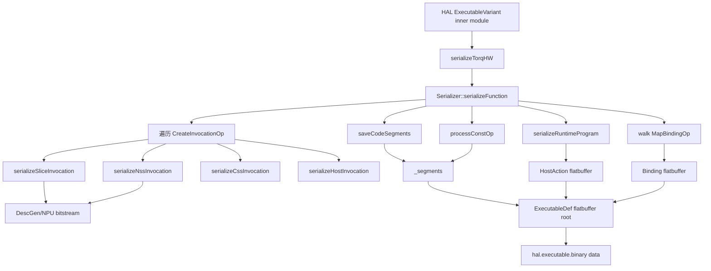

# serializeTorqHW 技术文档

## 1. 技术背景与目标

serializeTorqHW 是 Torq 目标后端把 executable-targets 阶段 IR 物化为 Torq flatbuffer 二进制的总入口，定义在 [Serialization.cpp](../../compiler/torq/Serialization/Serialization.cpp#L191)，声明在 [Serialization.h](../../compiler/torq/Serialization/Serialization.h#L17)，调用点位于 [TorqTarget.cpp](../../compiler/torq/Target/TorqTarget.cpp#L111-L145)。在 IREE HAL 的目标序列化阶段，TorqTarget 先拿到单个 executable variant 的 inner module，再通过 serializeTorqHW 把其中的 invocation、代码段、常量段、runtime action、binding 信息和可选调试信息统一编码成一个 flatbuffer，最终交给 hal.executable.binary。

这一步不能用普通 folder 替代。普通 folder 或 canonicalization 只擅长对单个 op 或局部 use-def 子图做等价化简，而 serializeTorqHW 做的是跨函数级别的汇总与打包：它要同时读取 create_invocation 上的地址属性、扫描 torq_hl.const 和 torq_hl.map_binding、从 torq_hl.start_program 和 torq_hl.wait_program 生成 runtime action，还要把 NPU bitstream 与 CSS/Host 可执行内容拼成统一二进制格式。这是一个后端目标编码过程，不是 IR 等价改写过程。

从流水线位置看，serializeTorqHW 假定前序 pass 已经完成程序 outline、地址分配、invocation 参数解析和对象编号分配。换句话说，它不负责“推导地址或 ID”，而是消费这些既有约定，把它们转成设备运行时能直接读取的 ExecutableDef。这个设计把“编排 IR”和“输出二进制”两层职责分离得比较清楚。

## 2. 技术架构

### 模块位置表

| 模块 | 位置 | 作用 |
| --- | --- | --- |
| 序列化入口 | [Serialization.cpp](../../compiler/torq/Serialization/Serialization.cpp#L191) | 定义 serializeTorqHW 和 Serializer 主流程。 |
| 头文件声明 | [Serialization.h](../../compiler/torq/Serialization/Serialization.h#L17) | 暴露 serializeTorqHW 接口。 |
| 目标后端挂载点 | [TorqTarget.cpp](../../compiler/torq/Target/TorqTarget.cpp#L111-L145) | 在 serializeExecutable 中调用 serializeTorqHW，并创建 hal.executable.binary。 |
| TorqHL invocation 约定 | [TorqHLOps.td](../../compiler/torq/Dialect/TorqHL/TorqHLOps.td#L665) | 定义 create_invocation、start_program、wait_program 等 op 及其属性。 |
| 地址分配 | [AssignAddressesPass.cpp](../../compiler/torq/Codegen/AssignAddressesPass.cpp#L320-L347) | 为 code sections 和 XRAM 常量/绑定写入地址。 |
| invocation 地址解析 | [ResolveInvocationArgumentsPass.cpp](../../compiler/torq/Codegen/ResolveInvocationArgumentsPass.cpp#L60-L147) | 把 executor_code_addresses、executor_args_addresses、result_addresses 回填到 invocation/wait。 |
| 对象与动作编号 | [AssignObjectsIdentifiersPass.cpp](../../compiler/torq/Codegen/AssignObjectsIdentifiersPass.cpp#L55-L90) | 写入 torq-buffer-ids 与 torq-action-id。 |
| 地址读取工具 | [MemoryUtils.cpp](../../compiler/torq/Utils/MemoryUtils.cpp#L176) | 提供 getXramAddress、getExecutorDataStartAddress、getDataStartAddress。 |
| 编码尺寸工具 | [EncodingUtils.cpp](../../compiler/torq/Utils/EncodingUtils.cpp#L95) | 提供 stride 与总大小计算函数。 |
| NSS 代码大小工具 | [CodeSizeUtils.cpp](../../compiler/torq/Utils/CodeSizeUtils.cpp#L8-L24) | 给 NSS block 提供当前固定大小上限。 |

### 组件图



### 关键属性与约定

| 属性/约定 | 设置函数或来源 | 读取/判定方式 | 用途 |
| --- | --- | --- | --- |
| xram_code_addresses | [AssignAddressesPass.cpp](../../compiler/torq/Codegen/AssignAddressesPass.cpp#L324-L340) 中的 createInvocationOp.setXramCodeAddresses | createInvocationOp.getXramCodeAddresses()，见 [Serialization.cpp](../../compiler/torq/Serialization/Serialization.cpp#L777-L783) | 指定每个 code section 的 XRAM 地址。 |
| executor_code_addresses | [ResolveInvocationArgumentsPass.cpp](../../compiler/torq/Codegen/ResolveInvocationArgumentsPass.cpp#L64-L78) 中的 createInvocationOp.setExecutorCodeAddresses | createInvocationOp.getExecutorCodeAddresses()，见 [Serialization.cpp](../../compiler/torq/Serialization/Serialization.cpp#L783-L789) | 指定执行器视角下的代码入口地址。 |
| executor_args_addresses | [ResolveInvocationArgumentsPass.cpp](../../compiler/torq/Codegen/ResolveInvocationArgumentsPass.cpp#L83-L124) 中的 createInvocationOp.setExecutorArgsAddresses | createInvocationOp.getExecutorArgsAddresses()，见 [Serialization.cpp](../../compiler/torq/Serialization/Serialization.cpp#L922-L929) | 指定 CSS/Host/NSS/Slice 调用参数地址。 |
| result_addresses | [ResolveInvocationArgumentsPass.cpp](../../compiler/torq/Codegen/ResolveInvocationArgumentsPass.cpp#L129-L147) 中的 waitProgramOp.setResultAddresses | `waitOp.getAttrOfType<DenseI64ArrayAttr>("result_addresses")` 或 `waitOp.getResultAddresses()` 约定 | 描述 wait_program 输出缓冲区地址。 |
| torq-buffer-ids | [AssignObjectsIdentifiersPass.cpp](../../compiler/torq/Codegen/AssignObjectsIdentifiersPass.cpp#L60-L69) | `op.getAttrOfType<DenseI64ArrayAttr>("torq-buffer-ids")`，见 [Serialization.cpp](../../compiler/torq/Serialization/Serialization.cpp#L1410-L1417) | 运行时 alloc/dealloc/wait 与调试信息使用的缓冲区 ID。 |
| torq-action-id | [AssignObjectsIdentifiersPass.cpp](../../compiler/torq/Codegen/AssignObjectsIdentifiersPass.cpp#L72-L84) | `op.getAttrOfType<IntegerAttr>("torq-action-id")`，见 [Serialization.cpp](../../compiler/torq/Serialization/Serialization.cpp#L1318-L1348) | 生成 runtime action 顺序与 buffer 生命周期信息。 |
| xram_address / lram_address | 地址 pass 写在 alloc、const、map_binding 等 op 上；读取工具在 [MemoryUtils.cpp](../../compiler/torq/Utils/MemoryUtils.cpp#L176-L205) | getXramAddress、getAddress、getDataStartAddress | 驱动常量段、binding、host copy 和 NDL 基址写入。 |

## 3. 代码实现详细流程

### 3.1 入口函数：校验 inner module，并委托 Serializer

```cpp
LogicalResult serializeTorqHW(mlir::ModuleOp moduleOp, DenseIntElementsAttr &binaryAttr) {
    auto dispatchName = getDispatchName(moduleOp);
    std::string dump_path = "";
    if (clTorqDescriptorDumpDir != "") {
        std::filesystem::create_directory(clTorqDescriptorDumpDir.getValue());
        dump_path = clTorqDescriptorDumpDir + "/" + dispatchName;
    }
    iree_compiler::FlatbufferBuilder builder;
    Serializer serializer(builder, dump_path);
    auto funcOps = llvm::to_vector(moduleOp.getOps<mlir::FunctionOpInterface>());
```

- 入口先从 executable variant 的 export 名拿 dispatchName，具体实现见 [Serialization.cpp](../../compiler/torq/Serialization/Serialization.cpp#L183-L189)。
- 如果启用了 descriptor dump，会提前为当前 dispatch 计算输出目录。
- Serializer 自身不拥有 FlatbufferBuilder，而是接收外部 builder 引用，避免中间层重复拷贝 flatbuffer 数据。

```cpp
    if (funcOps.size() == 0) {
        return moduleOp.emitError("no function found");
    }
    if (funcOps.size() > 1) {
        return moduleOp.emitError("Multiple functions not supported");
    }
    if (failed(serializer.serializeFunction(funcOps[0])))
        return failure();
    binaryAttr = builder.getBufferAttr(moduleOp.getContext());
    return success();
}
```

- 当前实现只支持一个 FunctionOpInterface；如果 inner module 中有多个函数，会直接失败。
- 真正的序列化逻辑全部进入 Serializer::serializeFunction，入口只做“单函数约束 + 二进制回传”。
- 最终输出形式是 DenseIntElementsAttr，后续由 [TorqTarget.cpp](../../compiler/torq/Target/TorqTarget.cpp#L138-L143) 填进 hal.executable.binary。

### 3.2 主控流程：先序列化 program，再补段、常量、runtime 和 binding

```cpp
LogicalResult Serializer::serializeFunction(mlir::FunctionOpInterface funcOp) {
    for (auto op : funcOp.getFunctionBody().getOps<torq_hl::CreateInvocationOp>()) {
        if (failed(serializeInvocation(op))) {
            return failure();
        }
    }
    if (!succeeded(saveCodeSegments())) {
        return failure();
    }
    for (auto constOp : funcOp.getFunctionBody().getOps<torq_hl::ConstOp>()) {
        if (failed(processConstOp(constOp))) {
            return failure();
        }
    }
```

- 顺序很重要：先把 Slice/NSS/CSS/Host invocation 转成 bitstream 或代码段，再统一保存 code segments，最后序列化常量。
- saveCodeSegments 只会把尚未保存过的 NPU bitstream 段放进 `_segments`，去重逻辑依赖 `_savedSegments`，见 [Serialization.cpp](../../compiler/torq/Serialization/Serialization.cpp#L1153-L1199)。
- processConstOp 既支持普通 DenseElements，也支持 splat 常量的展开写入，定义在 [Serialization.cpp](../../compiler/torq/Serialization/Serialization.cpp#L661-L727)。

```cpp
    auto maybeRuntimeProgram = serializeRuntimeProgram(funcOp);
    if (failed(maybeRuntimeProgram)) {
        return failure();
    }
    SmallVector<iree_hal_torq_Binding_ref_t> bindingRefs;
    funcOp.walk([&](syna::torq_hl::MapBindingOp mapBindingOp) {
        auto sizeBytes = getEncodedTotalSizeBytes(mapBindingOp.getResult().getType());
        bindingRefs.push_back(iree_hal_torq_Binding_create(
            _builder, mapBindingOp.getBindingIndex().getZExtValue(),
            getXramAddress(mapBindingOp.getOperation()).value(),
            mapBindingOp.getOffset().getZExtValue(), sizeBytes,
            mapBindingOp.getIsReadOnly(), mapBindingOp.getIsWriteOnly()));
    });
```

- runtime program 负责描述 host 侧动作序列，例如 host_copy、start_program、wait_program、alloc、dealloc。
- binding 信息不是从函数参数推断，而是显式遍历 torq_hl.map_binding。
- binding 的大小计算使用 [EncodingUtils.cpp](../../compiler/torq/Utils/EncodingUtils.cpp#L287-L291) 的编码总字节数，而不是 shape 元素数。

### 3.3 invocation 分派：按 executor 类型进入四条专用路径

```cpp
LogicalResult Serializer::serializeInvocation(torq_hl::CreateInvocationOp &createInvocationOp) {
    switch (createInvocationOp.getProgram().getType().getExecutor()) {
    case torq_hl::Executor::Slice:
        return serializeSliceInvocation(createInvocationOp);
    case torq_hl::Executor::CSS:
        return serializeCssInvocation(createInvocationOp);
    case torq_hl::Executor::NSS:
        return serializeNssInvocation(createInvocationOp);
    case torq_hl::Executor::Host:
        return serializeHostInvocation(createInvocationOp);
    default:
        return createInvocationOp->emitOpError("unsupported executor type for invocation");
    }
}
```

- 这里没有模式重写，核心是后端多态分发。
- 四种 executor 共用同一个 CreateInvocationOp 抽象，但序列化目标完全不同。
- 如果前序 IR 中 executor 类型与 program 类型不一致，会在这里暴露成硬错误。

### 3.4 Slice/NSS/CSS 三条主路径

```cpp
auto maybeLramCodeAddresses = createInvocationOp.getExecutorCodeAddresses();
auto maybeXramCodeAddresses = createInvocationOp.getXramCodeAddresses();
auto lramAddress = (*maybeLramCodeAddresses)[0];
auto xramAddress = (*maybeXramCodeAddresses)[0];

if (!_npu.beginCfg(slc, lramAddress, xramAddress)) {
    return failure();
}
uint32_t programSize = getEncodedTotalSizeBytes(codeType);
uint32_t remainingCfgSpace = 0x900;
```

- Slice 路径依赖 executor_code_addresses 与 xram_code_addresses 已在前序 pass 中填好，主实现见 [Serialization.cpp](../../compiler/torq/Serialization/Serialization.cpp#L966-L1062)。
- 它把 code section 划成 CFG 区与 NDL 区，并用固定 0x900 字节作为 CFG 预算。
- 预算与 code section 总大小的比较是防御式检查；如果 code section 太小，直接失败。

```cpp
if (!op.getXramCodeAddresses() || op.getXramCodeAddresses()->size() != 1) {
    return op->emitOpError("Expected exactly one XRAM code address for NSS program");
}
auto nssXramAddr = op.getXramCodeAddresses().value()[0];
auto nssLramAddr = op.getExecutorCodeAddresses().value()[0];
if (!_npu.nssBegin(nssLramAddr, nssXramAddr)) {
    return failure();
}
```

- NSS 路径见 [Serialization.cpp](../../compiler/torq/Serialization/Serialization.cpp#L775-L835)。
- 它要求恰好一个 XRAM 代码地址和一个 LRAM 入口地址，因为当前 NSS 程序模型就是单段代码入口。
- 每个 torq_hw.nss_task 会经由 processNssTask 编译成 bitstream，并用 [CodeSizeUtils.cpp](../../compiler/torq/Utils/CodeSizeUtils.cpp#L8-L24) 做 block 大小上限检查。

```cpp
auto cssExecutable =
    SymbolTable::lookupNearestSymbolFrom<iree_compiler::IREE::HAL::ExecutableOp>(
        cssProgram, cssProgram.getNameAttr());
auto executableBinaryOp =
    SymbolTable::lookupNearestSymbolFrom<iree_compiler::IREE::HAL::ExecutableBinaryOp>(
        cssExecutable, StringAttr::get(cssProgram.getContext(), "code"));
auto xramAddress = getXramAddress(createInvocationOp.getCodeSections()[0], 0);
auto text = executableBinaryOp.getData();
```

- CSS 路径见 [Serialization.cpp](../../compiler/torq/Serialization/Serialization.cpp#L871-L964)。
- 它不是现场生成 bitstream，而是回查 import_program 对应的 HAL executable.binary，把现成 CSS 代码段装进 Torq flatbuffer。
- 第二个 code section 则专门保存参数地址数组，第一个元素是参数个数，后续元素才是真正地址。

### 3.5 runtime action 序列化：把 host 可见动作转成 flatbuffer 指令流

```cpp
if (isa<torq_hl::ProgramOp, torq_hl::CreateInvocationOp, torq_hl::ConstOp,
        torq_hl::MapBindingOp, func::ReturnOp, torq_hl::ImportProgramOp,
        torq_hw::DispatchProfilingOp>(op) ||
    isDerivedMemRefOperation(&op)) {
    continue;
}
```

- runtime program 只保留“真正需要 host/runtime 执行的动作”，实现位于 [Serialization.cpp](../../compiler/torq/Serialization/Serialization.cpp#L1402-L1616)。
- program、create_invocation、const、map_binding 属于静态描述信息，不属于 action 流。
- derived memref op 会被跳过，因为它们只是视图变化，不代表独立分配或执行动作。

```cpp
if (auto hostActionOp = dyn_cast<torq_hl::HostCopyOp>(op)) {
    auto inputAddress = getDataStartAddress(hostActionOp.getInput());
    auto outputAddress = getDataStartAddress(hostActionOp.getOutput());
    auto hostCopyParams = iree_hal_torq_HostCopyParams_create(
        _builder, toBufferType(inputMemSpace), toBufferType(outputMemSpace),
        inputAddress.value(), outputAddress.value(),
        createUI32Vector(hostActionOp.getInputStridesBytes()),
        createUI32Vector(hostActionOp.getOutputStridesBytes()),
        createUI32Vector(hostActionOp.getShape()), hostActionOp.getElementSizeBytes());
```

- HostCopy 直接读取输入输出的“数据起始地址”，而不是 base address，这一点由 [MemoryUtils.cpp](../../compiler/torq/Utils/MemoryUtils.cpp#L405-L409) 保证。
- stride、shape 与 element size 一起决定 runtime 如何做 host 侧拷贝。
- 这也是 serializeTorqHW 依赖编码工具函数的原因之一：如果布局不是物理连续，runtime 仍要知道真实 stride。

```cpp
else if (auto allocOp = dyn_cast<memref::AllocOp>(op)) {
    auto maybeAddress = getAddress(allocOp.getResult());
    auto memSpace = getEncodingMemorySpace(allocOp.getType());
    auto size = getEncodedTotalSizeBytes(allocOp.getResult().getType());
    auto allocParams = iree_hal_torq_AllocParams_create(
        _builder, allocIdMap[allocOp.getMemref()], maybeAddress.value(), size,
        toBufferType(memSpace));
}
```

- alloc/dealloc 的语义依赖 torq-buffer-ids 已经稳定分配。
- 地址读取统一走 [MemoryUtils.cpp](../../compiler/torq/Utils/MemoryUtils.cpp#L340-L403) 的 getAddress 家族，不在序列化层重新判断 memory space。
- 这让序列化层可以只关心“输出协议格式”，把地址规则集中在 Utils 中维护。

### 3.6 依赖的 Utils 函数

```cpp
std::optional<int64_t> getXramAddress(Value value, int64_t offset) {
    if (auto createInvocationOp = value.getDefiningOp<torq_hl::CreateInvocationOp>()) {
        auto sectionAddresses = createInvocationOp.getXramCodeAddresses();
        auto sectionIndex = cast<OpResult>(value).getResultNumber() - 1;
        if (!sectionAddresses || sectionAddresses->size() <= sectionIndex) {
            return std::nullopt;
        }
        return (*sectionAddresses)[sectionIndex] + offset;
    }
    return getValueAddress(value, XRAM_ADDRESS_ATTR_NAME, offset);
}
```

- 见 [MemoryUtils.cpp](../../compiler/torq/Utils/MemoryUtils.cpp#L176-L189)。
- code section 结果值的 XRAM 地址不存放在结果上，而是挂在 create_invocation 的 xram_code_addresses 属性里。
- 这也是 serialization 里大量直接读取 createInvocationOp.getXramCodeAddresses() 的根源。

```cpp
std::optional<int64_t> getExecutorDataStartAddress(
    torq_hl::Executor executor, Value value, int64_t offset,
    TypedValue<torq_hl::InvocationType> invocation) {
    switch (executor) {
    case torq_hl::Executor::CSS:
        return getCssAddress(value, offset, invocation);
    case torq_hl::Executor::Host:
        if (getEncodingMemorySpace(type) != torq_hl::MemorySpace::Xram) return std::nullopt;
        return getDataStartAddress(value, offset, invocation);
```

- 见 [MemoryUtils.cpp](../../compiler/torq/Utils/MemoryUtils.cpp#L309-L335)。
- executorArgsAddresses 的语义不是统一物理地址，而是“执行器视角下能直接访问的数据地址”。
- CSS 会额外做地址空间重映射，Slice 只接受 LRAM，Host 只接受 XRAM，NSS 则直接沿用底层地址。

```cpp
SmallVector<int64_t> getEncodedStridesElements(ShapedType type) {
    if (auto memRefType = dyn_cast<MemRefType>(type)) {
        if (hasDenseEncoding(type)) {
            if (auto stridesAttr = mlir::dyn_cast_if_present<StridedLayoutAttr>(memRefType.getLayout())) {
                return SmallVector<int64_t>(stridesAttr.getStrides());
            } else if (memRefType.getLayout().isIdentity()) {
                ...
            }
        }
    }
```

- 主实现见 [EncodingUtils.cpp](../../compiler/torq/Utils/EncodingUtils.cpp#L95-L205)，大小接口见 [EncodingUtils.cpp](../../compiler/torq/Utils/EncodingUtils.cpp#L287-L291)。
- 这些函数负责把编码后的物理布局转成“真实 stride/总大小/有效数据大小”，否则 flatbuffer 中的地址和大小会与硬件布局不一致。
- serializeTorqHW 对 binding、host copy、alloc、CDMA 长度等都依赖这些结果。

## 4. 关键技术点

| 技术点 | 说明 |
| --- | --- |
| 单函数 inner module 假设 | serializeTorqHW 明确要求 inner module 中只存在一个 FunctionOpInterface，否则直接报错。 |
| 属性前置依赖强 | 大部分地址、ID 和参数信息都由前序 pass 回填；序列化阶段几乎不再做推导。 |
| executor 分流清晰 | Slice/NSS 走 DescGen 生成 bitstream，CSS/Host 主要做已有二进制与参数的封装。 |
| 代码段与常量段分离 | _segments 同时保存 bitstream、CSS 代码、Host 代码外加常量段，但来源路径不同。 |
| runtime action 独立建模 | host_copy、start_program、wait_program、alloc、dealloc 会被编码成单独的 HostAction 序列。 |
| 地址语义区分 base/data start | 序列化大量使用 getDataStartAddress，而不是简单的 base address，尤其对带 offset 的 memref 很关键。 |
| 调试输出可旁路落盘 | descriptor dump 逻辑不会改变最终 flatbuffer 内容，但会额外生成 tv.init.mem.lst 和 code/constant dump 文件。 |
| 缓冲区调试信息可选 | 只有启用 torq-enable-buffer-debug-info 时，才会把 buffer 生命周期和布局信息写进模型。 |

### 常见坑

- create_invocation 缺少 xram_code_addresses 或 executor_code_addresses 时，Slice/NSS/CSS 路径都会直接失败，问题通常不在序列化本身，而在前面的地址解析 pass。
- executor_args_addresses 的地址是“执行器可见数据起始地址”，不是所有场景都等于物理 base address，尤其 CSS 路径会做重映射。
- NSS block 大小检查当前依赖 [CodeSizeUtils.cpp](../../compiler/torq/Utils/CodeSizeUtils.cpp#L8-L24) 的固定上限；如果 bitstream 变大，错误会在序列化阶段而不是更早暴露。
- Host invocation 在启用 descriptor dump 时会失败，见 [Serialization.cpp](../../compiler/torq/Serialization/Serialization.cpp#L1376-L1384)，因为当前 dump 机制不支持 host programs。
- 如果常量是 splat，processConstOp 会走手工展开路径；这里对 element type 和 bit width 的支持是显式列举的，新增类型需要同步扩展。

## 5. 示例展示

### 5.1 序列化前：真实 executable-targets IR 片段

下面片段来自 [matmul_slice.9.executable-targets.mlir](../mlir/data.ignore/matmul_slice.9.executable-targets.mlir#L35-L49)。此时 invocation、常量和 binding 已经带好地址属性，正处于 serializeTorqHW 的输入形态。

```mlir
%invocation, %code_sections = torq_hl.create_invocation "nss_program_0"
  program(%0 : !torq_hl.program<nss>)
  {executor_args_addresses = array<i64: 640, 1094016>,
   executor_code_addresses = array<i64: 0>,
   "torq-buffer-ids" = array<i64: 2>,
   "torq-job-id" = 0 : i32,
   xram_code_addresses = array<i64: 1093376>}
  : !torq_hl.invocation<nss>, memref<640xi8>

%2 = "torq_hl.const"() <{value = dense<1.000000e+00> : tensor<2x128x64xf16>}>
  {"torq-buffer-ids" = array<i64: 4>, xram_address = 1048576 : i64}
  : () -> memref<2x128x64xf16>
```

- create_invocation 上已经有执行器代码地址和参数地址。
- const 上已经有 xram_address，可直接转成 Segment。
- torq-buffer-ids 也已准备完毕，后续 runtime action 和 debug info 可直接消费。

### 5.2 序列化后：目标后端生成 hal.executable.binary

serializeTorqHW 返回的 DenseIntElementsAttr 会被 [TorqTarget.cpp](../../compiler/torq/Target/TorqTarget.cpp#L138-L143) 包装成 hal.executable.binary。结果态在 MLIR 中的形状如下：

```mlir
hal.executable.binary public @dispatch attributes {
  data = dense<...> : vector<...xi8>,
  format = "<torq target format>",
  mime_type = "application/x-flatbuffers"
}
```

- 这里的 data 就是 serializeTorqHW 通过 FlatbufferBuilder 生成的 Torq ExecutableDef 字节流。
- 仓库中没有现成的 Torq flatbuffer 文本样例，因此结果态只能从后端构造代码反推其 MLIR 外观。
- 如果需要观察真实字节内容，建议配合 descriptor dump 或把 hal.executable.binary 重新 dump 出来。

### 5.3 可运行命令

先把模型编译到 executable-targets，再单独触发序列化阶段，最适合定位 serializeTorqHW 的输入与输出：

```bash
torq-compile --compile-to=executable-targets \
  -o ./test.hw.mlir \
  ./test.mlir

torq-compile --compile-from=executable-targets \
  -o ./test.vmfb \
  ./test.hw.mlir \
  --mlir-print-ir-after-all \
  --torq-dump-descriptors-dir=./descriptors
```

这组命令的 compile-to/compile-from 用法可参考 [debug_tips.md](../../doc/user-manual/debug_tips.md#L36-L45)。如果只是想在完整流水线中观察 executable-targets 产物，也可以参考 [run_compile_time_const_compute.sh](../mlir/run_compile_time_const_compute.sh#L1-L28) 里使用 torq-compile 或 torq-compile-main 的方式。

## 6. 调试开关

| 开关/机制 | 位置 | 作用 |
| --- | --- | --- |
| `DEBUG_TYPE = "torq-serialization"` | [Serialization.cpp](../../compiler/torq/Serialization/Serialization.cpp#L47) | 配合 `-debug` 查看序列化细节日志。 |
| `--torq-dump-descriptors-dir` | [Serialization.cpp](../../compiler/torq/Serialization/Serialization.cpp#L51-L54) | 把代码段、常量段和 tv.init.mem.lst 落到指定目录。 |
| `--torq-disable-async-slice-wait` | [Serialization.cpp](../../compiler/torq/Serialization/Serialization.cpp#L56-L59) | 强制 SliceStart 同步等待，影响 NSS task 中的 slice wait 位。 |
| `--torq-enable-buffer-debug-info` | [Serialization.cpp](../../compiler/torq/Serialization/Serialization.cpp#L61-L64) | 在 flatbuffer 中写入 buffer 生命周期、地址、shape、stride 等调试信息。 |
| `--mlir-print-ir-after-all` | [run_compile_time_const_compute.sh](../mlir/run_compile_time_const_compute.sh#L23-L28) | 观察 serializeTorqHW 之前的 executable-targets IR 和之后的 HAL binary 形态。 |
| `--mlir-print-ir-after-failure` | [debug_tips.md](../../doc/user-manual/debug_tips.md#L7) | 序列化失败时保留触发错误的 IR 现场。 |

调试时最常见的组合是 `-debug --mlir-print-ir-after-all --torq-dump-descriptors-dir=...`。前者看控制流，第二个看 IR，第三个看真正落盘的段内容，三者结合能把“属性没写好”和“序列化逻辑写错”分开。

## 7. 参考

- [Serialization.cpp](../../compiler/torq/Serialization/Serialization.cpp)
- [Serialization.h](../../compiler/torq/Serialization/Serialization.h)
- [TorqTarget.cpp](../../compiler/torq/Target/TorqTarget.cpp)
- [TorqHLOps.td](../../compiler/torq/Dialect/TorqHL/TorqHLOps.td)
- [AssignAddressesPass.cpp](../../compiler/torq/Codegen/AssignAddressesPass.cpp)
- [ResolveInvocationArgumentsPass.cpp](../../compiler/torq/Codegen/ResolveInvocationArgumentsPass.cpp)
- [AssignObjectsIdentifiersPass.cpp](../../compiler/torq/Codegen/AssignObjectsIdentifiersPass.cpp)
- [MemoryUtils.cpp](../../compiler/torq/Utils/MemoryUtils.cpp)
- [EncodingUtils.cpp](../../compiler/torq/Utils/EncodingUtils.cpp)
- [CodeSizeUtils.cpp](../../compiler/torq/Utils/CodeSizeUtils.cpp)
- [HALOps.h](../../third_party/iree/compiler/src/iree/compiler/Dialect/HAL/IR/HALOps.h)
- [FlatbufferUtils.h](../../third_party/iree/compiler/src/iree/compiler/Utils/FlatbufferUtils.h)
- [GreedyPatternRewriteDriver.h](../../third_party/iree/compiler/src/mlir/include/mlir/Transforms/GreedyPatternRewriteDriver.h)
