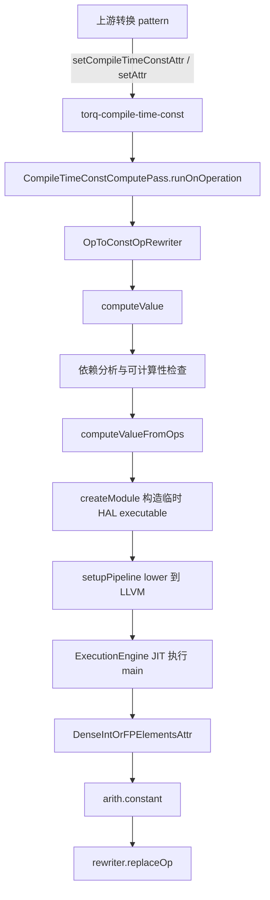

# CompileTimeConstComputePass 技术文档

## 1. 技术背景与目标

CompileTimeConstComputePass 的职责，是把已经被上游显式标记为编译期常量的张量计算，在编译流水线内部直接求值，并将原始计算 op 替换成 `arith.constant`。它挂载在 [TORQLowerExecutableTargetPass.cpp](../../compiler/torq/Codegen/TORQLowerExecutableTargetPass.cpp#L188-L210) 的 slice 路径末尾，位于 kernel selection、tensor encoding、slicing、fold convert 之后，CPU/NSS 程序 outline 之前。这个位置很关键：到这里，权重 pack、维度扩展、slice 重排等结构化改写已经成形，但还没有进入后续程序切分和地址解析，最适合把纯常量部分提前固化。

这个 Pass 不能用普通 folder 替代。普通 `fold` 更适合单个 op 的局部常量折叠，而 CompileTimeConstComputePass 处理的是一段跨多个 producer 的依赖链，并且这些依赖经常是 `tensor.pack`、`tensor.insert_slice`、`tensor.expand_shape`、`linalg.generic` 这类必须经过完整 lowering 后才能得到精确值的张量计算。这里真正的求值入口 [ComputeConstants.cpp](../../compiler/torq/Utils/ComputeConstants.cpp#L297-L595) 会重建临时 HAL executable、运行 IREE/LLVM CPU lowering pipeline，并用 ExecutionEngine 做一次 JIT 执行，这已经明显超出了普通 folder 的工作边界。

从设计上看，这个 Pass 用属性契约把“谁发现可编译期求值的候选”与“谁真正执行求值”解耦。上游 pattern 只需写入 `torq-compile-time-const` 属性，下游统一由本 Pass 收集和处理。这样做的好处是：权重重排、padding、interleave、pack 等逻辑可以各自独立演化，而具体的常量求值实现只维护一份。

## 2. 技术架构

### 模块位置表

| 模块 | 位置 | 作用 |
| --- | --- | --- |
| Pass 源码 | [CompileTimeConstComputePass.cpp](../../compiler/torq/Codegen/CompileTimeConstComputePass.cpp#L1-L81) | 定义 pass 主体和 rewrite pattern。 |
| Pass 声明 | [Passes.td](../../compiler/torq/Codegen/Passes.td#L323-L332) | 注册命令名、summary、构造函数和依赖 dialect。 |
| Pass 头文件 | [Passes.h](../../compiler/torq/Codegen/Passes.h#L63-L66) | 暴露 `createCompileTimeConstComputePass()`。 |
| 流水线挂载 | [TORQLowerExecutableTargetPass.cpp](../../compiler/torq/Codegen/TORQLowerExecutableTargetPass.cpp#L188-L210) | 在 slice 路径中把本 Pass 接到 `createFoldConvertPass()` 之后。 |
| 常量求值入口 | [ComputeConstants.h](../../compiler/torq/Utils/ComputeConstants.h#L9-L13) | 暴露 `computeValue()` 接口。 |
| 常量求值实现 | [ComputeConstants.cpp](../../compiler/torq/Utils/ComputeConstants.cpp#L297-L595) | 做依赖分析、构造临时 module、lower、JIT 和结果回填。 |
| 属性工具 | [ExecutorAssignment.h](../../compiler/torq/Utils/ExecutorAssignment.h#L7-L12) | 暴露 compile-time-const 属性的设置与判定函数。 |
| 属性工具实现 | [ExecutorAssignment.cpp](../../compiler/torq/Utils/ExecutorAssignment.cpp#L4-L33) | 定义属性名 `torq-compile-time-const` 和 helper。 |
| 典型属性设置点 | [KernelSelectionPass.cpp](../../compiler/torq/Codegen/KernelSelectionPass.cpp#L68-L78) | 对 `tensor.pack` 结果打上编译期常量属性。 |
| 典型属性设置点 | [LinalgToTorqHLPrePattern.cpp](../../compiler/torq/Conversions/LinalgToTorqHL/LinalgToTorqHLPrePattern.cpp#L94-L105) | 对新构造的 `linalg.generic` 直接写入同名属性。 |

### 组件图



### 关键属性与约定

| 项目 | 说明 |
| --- | --- |
| 属性名 | `torq-compile-time-const`，定义在 [ExecutorAssignment.cpp](../../compiler/torq/Utils/ExecutorAssignment.cpp#L4-L6)。 |
| 设置函数 | `setCompileTimeConstAttr(Operation *op)`，见 [ExecutorAssignment.cpp](../../compiler/torq/Utils/ExecutorAssignment.cpp#L25-L27)。 |
| 判定函数 | `isCompileTimeConst(Operation *op)`，见 [ExecutorAssignment.cpp](../../compiler/torq/Utils/ExecutorAssignment.cpp#L29-L33)。 |
| Pass 命令名 | `torq-compile-time-const-compute`，定义在 [Passes.td](../../compiler/torq/Codegen/Passes.td#L323-L332)。 |
| 结果约定 | 当前 pattern 固定读取 `op->getResults()[0]`，因此候选 op 需要至少有一个结果，且该结果应为 ranked tensor。 |
| 执行约定 | 常量求值通过临时 HAL executable 的 `main` 函数完成，结果写入 binding 0 对应的输出 buffer，见 [ComputeConstants.cpp](../../compiler/torq/Utils/ComputeConstants.cpp#L336-L392)。 |

## 3. 代码实现详细流程

### runOnOperation：收集候选 op 并驱动局部 rewrite

```cpp
void runOnOperation() override {
    SmallVector<Operation *> opsToProcess;
    auto funcOp = getOperation();
    funcOp->walk([&](Operation *op) {
        if (!isCompileTimeConst(op)) {
            return WalkResult::advance();
        }
        opsToProcess.push_back(op);
        return WalkResult::advance();
    });
    RewritePatternSet patterns(&getContext());
    patterns.add<OpToConstOpRewriter>(&getContext());
```

- Pass 运行在 `FunctionOpInterface` 上，只扫描当前函数。
- 候选集合完全依赖 `isCompileTimeConst` 判定，因此属性是唯一入口契约。
- 先收集 `opsToProcess` 再交给 `applyOpPatternsAndFold`，避免对整个函数做无界模式匹配。

```cpp
    if (failed(applyOpPatternsAndFold(opsToProcess, std::move(patterns)))) {
        return signalPassFailure();
    }
}
```

- 如果 pattern 应用失败，Pass 直接 `signalPassFailure()`，防止错误常量继续进入后续流水线。

### 核心 RewritePattern：把候选 op 替换成 arith.constant

```cpp
LogicalResult matchAndRewrite(Operation *op, PatternRewriter &rewriter) const override {
    if (!isCompileTimeConst(op)) {
        return failure();
    }

    auto constAttr = computeValue(op->getResults()[0], true, {});
    if (failed(constAttr)) {
        op->emitError() << "Failed to compute compile-time constant";
        return failure();
    }
```

- `MatchAnyOpTypeTag()` 让 pattern 理论上匹配任意 op，但实际过滤仍由属性完成。
- `computeValue(..., true, {})` 表示递归追溯依赖链，并且当前调用不使用 `assumeZero`。
- 失败时会把错误挂到原 op 上，方便在 IR dump 或诊断里反查源头。

```cpp
    auto constOp = rewriter.create<arith::ConstantOp>(op->getLoc(), *constAttr);
    rewriter.replaceOp(op, constOp);
    return success();
}
```

- 求值成功后，把结果物化成 `arith.constant`。
- 这里只替换原 op，自身不做死代码清理；后续 canonicalizer/CSE 会继续清掉无用 producer。

### computeValue：分析依赖、过滤不可静态执行的路径

```cpp
auto outputType = dyn_cast<RankedTensorType>(value.getType());
if (!outputType) {
    return failure();
}

if (!value.getDefiningOp()) {
    return failure();
}
```

- 目标结果必须是 ranked tensor。
- 如果目标 value 本身是函数参数或 block 外部输入，就无法在当前编译期路径上直接求值。

```cpp
if (isa<IREE::Flow::DispatchTensorLoadOp, IREE::HAL::InterfaceBindingSubspanOp>(operandOp)) {
    LLVM_DEBUG({
        llvm::dbgs() << "Value depends on inputs, cannot compute statically\n";
    });
    return WalkResult::interrupt();
}
```

- 只要依赖链里碰到 dispatch 输入，就立刻判定为不可静态求值。
- 这一步避免把运行时输入错误地当成编译期常量。

```cpp
SmallVector<Operation *> ops;
value.getDefiningOp()->getParentOp()->walk([&](Operation *op) {
    if (opsSet.contains(op)) {
        ops.push_back(op);
    }
});

auto output = computeValueFromOps(value.getDefiningOp()->getLoc(), value, ops, assumeZero);
```

- `opsSet` 保存“求值所需的最小 op 集合”。
- 再按父 op 的 walk 顺序重排为 `ops`，保证 clone 到临时函数后 use-def 关系合法。

### computeValueFromOps：构造临时 executable，lower 到 LLVM 并 JIT 执行

```cpp
ModuleOp moduleOp = ModuleOp::create(loc);
auto maybeVariantOp =
    createModule(moduleOp, moduleOp.getContext(), loc, value, ops, assumeZero);

auto pm = PassManager(value.getContext());
setupPipeline(pm);
if (failed(pm.run(moduleOp))) {
    return failure();
}
```

- `createModule` 会把待计算依赖链 clone 到一个独立 module 中，而不是直接修改原 IR。
- `setupPipeline` 复用 IREE CPU lowering pass，把张量级 IR 降到 LLVM dialect。

```cpp
replaceStackAllocationsWithMalloc(*maybeVariantOp);

auto maybeEngine =
    mlir::ExecutionEngine::create(maybeVariantOp->getInnerModule(), engineOptions);
if (!maybeEngine) {
    return failure();
}
```

- 为了避免大临时 buffer 通过 `llvm.alloca` 撑爆栈，先把栈分配改成 `malloc/free`。
- 然后用 ExecutionEngine 对 lowered inner module 做一次进程内 JIT 编译。

```cpp
void *bindingsAddr[1];
bindingsAddr[0] = outputData.data();
dispatch_state.binding_ptrs = bindingsAddr;

auto main = engine->lookup("main");
auto mainFn = reinterpret_cast<MainFnType>(main.get());
mainFn(&environment, &dispatch_state, &workgroup_state);
```

- 临时 `main` 函数遵循 IREE executable ABI，没有普通返回值，而是把结果写入 binding 0 对应的输出 buffer。
- `outputData` 就是宿主侧接收结果的原始字节缓冲区。

```cpp
DenseIntOrFPElementsAttr output =
    cast<DenseIntOrFPElementsAttr>(DenseElementsAttr::getFromRawBuffer(outputType, outputData));
return output;
```

- JIT 运行结束后，把 raw buffer 重解释为 `DenseElementsAttr`。
- 最终结果回到 Pass 中，由 rewrite pattern 生成 `arith.constant`。

### 属性工具与上游标记点：谁负责给候选 op 打标签

```cpp
void setCompileTimeConstAttr(Operation *op) {
    op->setAttr(COMPILE_TIME_CONST_ATTR_NAME, BoolAttr::get(op->getContext(), true));
}

bool isCompileTimeConst(Operation *op) {
    auto attr = op->getAttr(COMPILE_TIME_CONST_ATTR_NAME);
    if (!attr)
        return false;
    return mlir::cast<BoolAttr>(attr).getValue();
}
```

- 这组 helper 定义了 Pass 与上游转换共享的稳定契约。
- 直接手写字符串属性也能工作，但长期更推荐走 helper，避免属性名漂移。

```cpp
auto packedWeights =
    rewriter.create<tensor::PackOp>(loc, weights, empty, innerDimsPos, innerTiles, zeroVal);

setCompileTimeConstAttr(packedWeights);
setTargetExecutorAttr(packedWeights, torq_hl::Executor::NSS);
```

- [KernelSelectionPass.cpp](../../compiler/torq/Codegen/KernelSelectionPass.cpp#L68-L78) 中，权重 pack 结果就是本 Pass 的典型输入来源。
- 这说明 CompileTimeConstComputePass 主要服务于“先做权重布局重排，再把结果固化成常量”的路径。

```cpp
genericOp->setAttr("torq-compile-time-const", rewriter.getBoolAttr(true));
auto result = computeConstant(genericOp.getResult(0));
```

- [LinalgToTorqHLPrePattern.cpp](../../compiler/torq/Conversions/LinalgToTorqHL/LinalgToTorqHLPrePattern.cpp#L102-L105) 也会直接写入同名属性。
- 这里展示了另一类上游来源：人为构造一个张量变换，再立即尝试常量化。

## 4. 关键技术点

| 技术点 | 说明 |
| --- | --- |
| 属性驱动执行 | Pass 不自己猜测哪些 op 可算，而是依赖 `torq-compile-time-const` 这个显式契约。 |
| 递归依赖切片 | `computeValue` 会反向追溯所有 producer，只保留求值所需的最小 op 集。 |
| 临时 module 求值 | 为避免污染主 IR，常量求值在独立 `ModuleOp` 中完成。 |
| 复用 IREE CPU lowering | 张量级计算通过 [ComputeConstants.cpp](../../compiler/torq/Utils/ComputeConstants.cpp#L145-L225) 中的 pipeline 降到 LLVM，再执行。 |
| JIT 而非解释执行 | 结果通过 ExecutionEngine 即时编译运行获得，而不是靠静态模式枚举。 |
| ABI 方式回传结果 | 临时 `main` 把结果写到 binding 0 的 buffer，再转成 `DenseIntOrFPElementsAttr`。 |
| 栈分配兜底 | `replaceStackAllocationsWithMalloc` 把大块临时 `alloca` 改成堆分配，降低栈溢出风险。 |
| 失败传播明确 | 依赖运行时输入、类型不合法、lower/JIT 失败都会中断该 op 的编译期求值。 |

常见坑：

- 被标记的 op 必须至少有一个结果；当前 pattern 固定读取第一个结果。
- 结果必须是 ranked tensor，scalar 或 unranked tensor 不在当前实现支持范围内。
- 如果依赖链里出现 `flow.dispatch.tensor.load` 或 `hal.interface.binding.subspan`，求值会直接失败。
- `applyOpPatternsAndFold` 只处理收集到的 `opsToProcess`，如果上游漏打属性，本 Pass 不会接管该 op。
- `computeValue` 失败时当前 pattern 会向原 op 发出错误，必要时应结合 IR dump 一起排查。

## 5. 示例展示

### Pass 前

下面的真实片段来自 [log.txt](../../demo/mlir/data.ignore/log.txt#L7304-L7338)，展示了在 `torq-compile-time-const-compute` 之前，`tensor.pack` 仍然作为普通计算 op 存在，并带有 `torq-compile-time-const = true` 属性。

```mlir
%cst_1 = arith.constant dense<1.000000e+00> : tensor<256x128xf16>
%3 = tensor.empty() : tensor<4x128x64xf16>
%pack = tensor.pack %cst_1 padding_value(%cst_0 : f16)
  inner_dims_pos = [0] inner_tiles = [64] into %3
  {"torq-compile-time-const" = true, "torq-executor" = #torq_hl.executor<nss>}
  : tensor<256x128xf16> -> tensor<4x128x64xf16>
%extracted_slice = tensor.extract_slice %pack[%8, 0, 0] [2, 128, 64] [1, 1, 1]
  : tensor<4x128x64xf16> to tensor<2x128x64xf16>
```

这个例子很典型：`tensor.pack` 只是权重重排的一步，本身没有运行时输入，适合提前固化成常量。

### Pass 后

同一个 dispatch 在 [log.txt](../../demo/mlir/data.ignore/log.txt#L7339-L7360) 中经过本 Pass 后，`tensor.pack` 已经被提前求值，后续直接消费 `arith.constant`：

```mlir
func.func @main_dispatch_0_matmul_1x256x128_f16() {
  %cst = arith.constant dense<0.000000e+00> : tensor<256xf32>
  %c0 = arith.constant 0 : index
  %0 = hal.interface.binding.subspan set(0) binding(0) type(storage_buffer)
    alignment(64) offset(%c0) flags(ReadOnly)
    : !flow.dispatch.tensor<readonly:tensor<1x128xf16>>
  %1 = hal.interface.binding.subspan set(0) binding(1) type(storage_buffer)
    alignment(64) offset(%c0)
    : !flow.dispatch.tensor<writeonly:tensor<1x256xf16>>
  %cst_0 = arith.constant dense<1.000000e+00> : tensor<2x128x64xf16>
  %8 = torq_hl.convert out(%7 : tensor<2x128x64xf16, #torq_hl<enc mem_space = lram>>)
    in(%cst_0 : tensor<2x128x64xf16>)
    {encoding = #torq_hl<enc mem_space = lram>}
    -> tensor<2x128x64xf16, #torq_hl<enc mem_space = lram>>
```

对比前后可以看到，原先要运行时再做的 `tensor.pack` 已经被折叠成了 `tensor<2x128x64xf16>` 的常量，后续只剩下常量到目标内存空间的 `torq_hl.convert`。

### 可运行命令行

可以直接复用 [run_slice.sh](../../demo/mlir/run_slice.sh#L1-L7) 的命令来观察这个 Pass 的前后 IR：

```bash
cd demo/mlir
source /Users/wangyansheng/code/venv/bin/activate
export PATH=/Users/wangyansheng/code/iree-build/third_party/iree/tools/:$PATH
torq-compile ./matmul_slice.mlir -o ./data.ignore/output.vmfb \
  --mlir-print-ir-after-all \
  --dump-compilation-phases-to=data.ignore \
  > ./data.ignore/log.txt 2>&1
```

如果只想快速定位本 Pass 的效果，可以在生成日志后执行：

```bash
grep -n "CompileTimeConstCompute" demo/mlir/data.ignore/log.txt
sed -n '7304,7360p' demo/mlir/data.ignore/log.txt
```

## 6. 调试开关

本 Pass 源文件自身没有额外定义 `llvm::cl::opt`，但与它强绑定的常量求值工具暴露了一个专用开关 [ComputeConstants.cpp](../../compiler/torq/Utils/ComputeConstants.cpp#L44-L47)：

| 开关/选项 | 位置 | 作用 |
| --- | --- | --- |
| `--torq-dump-compute-constants-ir=<dir>` | [ComputeConstants.cpp](../../compiler/torq/Utils/ComputeConstants.cpp#L44-L47) | 把 JIT 求值用到的临时 IR 按 pass 树导出到目录。 |
| `DEBUG_TYPE = "torq-compute-const"` | [CompileTimeConstComputePass.cpp](../../compiler/torq/Codegen/CompileTimeConstComputePass.cpp#L24-L26) | 控制本 Pass 的 LLVM debug 输出域。 |
| `DEBUG_TYPE = "torq-compute-constants"` | [ComputeConstants.cpp](../../compiler/torq/Utils/ComputeConstants.cpp#L35-L37) | 控制常量求值 helper 的 LLVM debug 输出域。 |
| `--mlir-print-ir-after-all` | [run_slice.sh](../../demo/mlir/run_slice.sh#L1-L7) | 打印全流水线每一步 IR，便于观察本 Pass 前后差异。 |
| `--dump-compilation-phases-to=<dir>` | [run_slice.sh](../../demo/mlir/run_slice.sh#L1-L7) | 把各阶段 IR dump 到目录树，适合离线对照。 |

调试时建议组合使用 `--torq-dump-compute-constants-ir` 与全流水线 IR dump。前者看的是“为了求值而临时构造的 executable”，后者看的是“主编译流水线里这个 Pass 前后的 IR 变化”，两者结合最容易定位问题。

## 7. 参考

- [CompileTimeConstComputePass.cpp](../../compiler/torq/Codegen/CompileTimeConstComputePass.cpp#L1-L81)
- [Passes.td](../../compiler/torq/Codegen/Passes.td#L323-L332)
- [Passes.h](../../compiler/torq/Codegen/Passes.h#L63-L66)
- [TORQLowerExecutableTargetPass.cpp](../../compiler/torq/Codegen/TORQLowerExecutableTargetPass.cpp#L188-L210)
- [ComputeConstants.h](../../compiler/torq/Utils/ComputeConstants.h#L9-L13)
- [ComputeConstants.cpp](../../compiler/torq/Utils/ComputeConstants.cpp#L297-L595)
- [ExecutorAssignment.h](../../compiler/torq/Utils/ExecutorAssignment.h#L7-L12)
- [ExecutorAssignment.cpp](../../compiler/torq/Utils/ExecutorAssignment.cpp#L4-L33)
- [KernelSelectionPass.cpp](../../compiler/torq/Codegen/KernelSelectionPass.cpp#L68-L78)
- [LinalgToTorqHLPrePattern.cpp](../../compiler/torq/Conversions/LinalgToTorqHL/LinalgToTorqHLPrePattern.cpp#L94-L105)
- [run_slice.sh](../../demo/mlir/run_slice.sh#L1-L7)
- [log.txt](../../demo/mlir/data.ignore/log.txt#L7304-L7360)
- [IREECodegenAttrs.h](../../third_party/iree/compiler/src/iree/compiler/Codegen/Dialect/Codegen/IR/IREECodegenAttrs.h)
- [Passes.cpp](../../third_party/iree/compiler/src/iree/compiler/Codegen/LLVMCPU/Passes.cpp#L1-L120)
- [ConstExpr.h](../../third_party/iree/compiler/src/iree/compiler/Dialect/Util/Analysis/Constant/ConstExpr.h#L20-L120)
- [OpOracle.h](../../third_party/iree/compiler/src/iree/compiler/Dialect/Util/Analysis/Constant/OpOracle.h#L1-L62)
