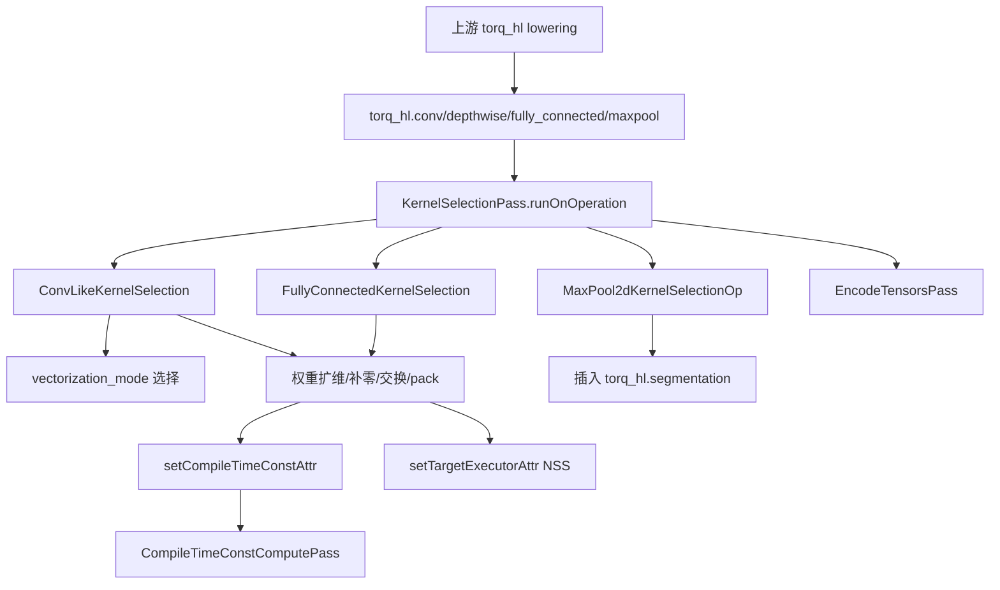

# KernelSelectionPass 技术文档

## 1. 技术背景与目标

KernelSelectionPass 的职责，是把已经降到 `torq_hl` 语义层的卷积、深度卷积、全连接和部分池化算子，进一步改写成硬件可执行的具体 kernel 形态。它不是简单做 canonicalization，也不是普通的 folder：这个 Pass 需要结合输出形状、stride、权重元素类型和硬件向量化模式，决定最终使用哪种 `vectorization_mode`，并在必要时重排、扩维、补零或切换权重布局。

它挂载在 [TORQLowerExecutableTargetPass.cpp](../../compiler/torq/Codegen/TORQLowerExecutableTargetPass.cpp#L188-L210) 的 slice 路径中，位于 `TorqHlTile` 之后、`EncodeTensors` 之前。这个位置很关键：到这里，上游已经把 `linalg`/`tensor` 形式转换成了 `torq_hl` 算子，但权重仍然是逻辑布局；KernelSelectionPass 负责把这些逻辑布局改成 NSS 真正期望的物理布局，并把后续可在编译期求值的重排结果标记出来。

这类工作不能由普通 folder 替代。原因有三点。第一，它的决策依赖目标硬件约束，例如 `_64x4`、`_32x8`、`_16x16` 这些向量化模式，以及 stride-2 下特定列交换的约束。第二，它会显式引入新 IR，例如 `tensor.pack`、`tensor.insert_slice`、`tensor.expand_shape`、`torq_hl.segmentation`。第三，它要和后续 [CompileTimeConstComputePass](../../compiler/torq/Codegen/CompileTimeConstComputePass.cpp#L1-L81) 协同工作，通过 `torq-compile-time-const` 属性把“权重重排可编译期执行”这一事实传下去。

## 2. 技术架构

### 模块位置表

| 模块 | 位置 | 作用 |
| --- | --- | --- |
| Pass 源码 | [KernelSelectionPass.cpp](../../compiler/torq/Codegen/KernelSelectionPass.cpp#L1-L491) | 定义全部 rewrite pattern 和 pass 主体。 |
| Pass 声明 | [Passes.td](../../compiler/torq/Codegen/Passes.td#L257-L266) | 注册 `torq-kernel-selection` 命令名与依赖方言。 |
| Pass 头文件 | [Passes.h](../../compiler/torq/Codegen/Passes.h#L49-L53) | 暴露 `createKernelSelectionPass()`。 |
| 流水线挂载 | [TORQLowerExecutableTargetPass.cpp](../../compiler/torq/Codegen/TORQLowerExecutableTargetPass.cpp#L188-L210) | 将本 Pass 放在 `TorqHlTile` 之后、`EncodeTensors` 之前。 |
| 属性工具 | [ExecutorAssignment.h](../../compiler/torq/Utils/ExecutorAssignment.h#L1-L12) | 声明 `setCompileTimeConstAttr` 与 `setTargetExecutorAttr`。 |
| 属性工具实现 | [ExecutorAssignment.cpp](../../compiler/torq/Utils/ExecutorAssignment.cpp#L1-L37) | 定义 `torq-compile-time-const` 和 `torq-executor` 的写入逻辑。 |
| 常量构造工具 | [ConversionUtils.h](../../compiler/torq/Utils/ConversionUtils.h#L142-L214) | 提供 `createI8Const`、`createIConst`，用于分割算子的 dummy 权重和 bias。 |
| 对齐工具 | [TorqUtils.h](../../compiler/torq/Utils/TorqUtils.h#L27-L39) | 提供 `div_ceil`、`align_ceil` 等硬件相关取整函数。 |
| 真实示例 | [compile_time_const_compute.mlir](../../demo/mlir/compile_time_const_compute.mlir) | 触发全连接权重重排与编译期常量化。 |
| 真实前后日志 | [log.txt](../../demo/mlir/data.ignore/log.txt#L7192-L7222) | 展示 `TorqHlTile` 之后与 `KernelSelection` 之后的 IR 差异。 |

### 组件图



### 关键属性与约定

| 项目 | 说明 |
| --- | --- |
| Pass 命令名 | `torq-kernel-selection`，定义在 [Passes.td](../../compiler/torq/Codegen/Passes.td#L257-L266)。 |
| 调度方式 | `applyPatternsAndFoldGreedily`，见 [KernelSelectionPass.cpp](../../compiler/torq/Codegen/KernelSelectionPass.cpp#L477-L489)。 |
| 向量化属性 | `vectorization_mode`，pattern 只处理 `None` 状态的 op。 |
| 执行器属性 | `torq-executor`，通过 [ExecutorAssignment.cpp](../../compiler/torq/Utils/ExecutorAssignment.cpp#L21-L23) 写入 NSS。 |
| 编译期常量属性 | `torq-compile-time-const`，通过 [ExecutorAssignment.cpp](../../compiler/torq/Utils/ExecutorAssignment.cpp#L25-L27) 写入。 |
| 全连接权重约定 | 统一重排到 `OI[HW]O` 风格 pack 结果，见 [KernelSelectionPass.cpp](../../compiler/torq/Codegen/KernelSelectionPass.cpp#L55-L76)。 |
| stride-2 特殊约定 | 部分 conv/maxpool 需要显式 segmentation，见 [KernelSelectionPass.cpp](../../compiler/torq/Codegen/KernelSelectionPass.cpp#L127-L148) 与 [KernelSelectionPass.cpp](../../compiler/torq/Codegen/KernelSelectionPass.cpp#L446-L468)。 |

## 3. 代码实现详细流程

### runOnOperation：注册模式并做贪心重写

```cpp
void KernelSelectionPass::runOnOperation() {
    auto funcOp = getOperation();

    MLIRContext *ctx = funcOp.getContext();
    RewritePatternSet patterns(ctx);

    patterns.add<ConvLikeKernelSelection<torq_hl::Conv2DOp>>(ctx);
    patterns.add<ConvLikeKernelSelection<torq_hl::DepthwiseConv2DOp>>(ctx);
    patterns.add<FullyConnectedKernelSelection>(ctx);
    patterns.add<MaxPool2dKernelSelectionOp>(ctx);

    if (failed(applyPatternsAndFoldGreedily(getOperation(), std::move(patterns)))) {
        return signalPassFailure();
    }
}
```

- Pass 本身不做手写遍历分发，而是把 4 类 pattern 一次性注册给 GreedyPatternRewriteDriver。
- 这意味着一个 op 的改写会立刻反馈给后续 pattern 匹配，例如先改写权重，再继续折叠生成的 `tensor.empty`/`tensor.insert_slice`。
- 如果重写过程出现失败，整个 pass 直接 `signalPassFailure()`，不会静默跳过。

### 核心 RewritePattern 一：全连接权重重排与向量化模式落地

```cpp
LogicalResult matchAndRewrite(torq_hl::FullyConnectedOp op,
                              PatternRewriter &rewriter) const {
    if (op.getVectorizationMode() != torq_hl::VectorizationModeEnum::None) {
        return failure();
    }
    Value weights = op.getWeights();
    arith::ConstantOp constOp = weights.getDefiningOp<arith::ConstantOp>();
    if (!constOp) {
        op->emitError() << "weights don't come from a arith::ConstantOp";
        llvm::report_fatal_error("cannot select kernel", true);
    }
    auto vectorizationMode = getVectorizationMode(op);
    int parallel_outs = 64;
    weights = weights_OIHW_to_OIHWO(
        rewriter, op.getLoc(), weights, parallel_outs,
        mlir::cast<DenseIntOrFPElementsAttr>(constOp.getValue()).getType().getElementType());
```

- 全连接 pattern 的前提是“还没选过 kernel”且“权重来自 `arith.constant`”。
- 对全连接来说，`parallel_outs` 直接固定为 `64`，因此最典型的布局变化就是把输出通道维按 64 分块。
- `getVectorizationMode(op)` 对 rank `<= 2` 的输出默认返回 `_64x4`，所以日志里会看到 `vectorization_mode` 从 `0` 变成 `4`。

```cpp
    rewriter.modifyOpInPlace(op, [&]() {
        op.setVectorizationMode(vectorizationMode);
        op.setOperand(1, weights);
    });
    return success();
}
```

- pattern 只修改 op 自身属性和第 2 个操作数，不重新建一个新的 `FullyConnectedOp`。
- 这让前后 IR 更稳定，后续 Pass 也更容易基于原 op 继续推断编码和切片。

### 核心 RewritePattern 二：卷积/深度卷积的布局变换与 stride-2 特化

```cpp
if (weightShape.size() == 3) {
    weights = weights_insert_dimension(rewriter, op.getLoc(), weights, 1);
    rewriter.modifyOpInPlace(op, [&]() { op.setOperand(1, weights); });
    weightShape = {weightShape[0], 1, weightShape[1], weightShape[2]};
}

rewriter.modifyOpInPlace(op, [&]() { op.setVectorizationMode(vectorizationMode); });
if (weightElementType.isInteger() || weightElementType.isBF16()) {
    if (isStride2(op) && weight_shape[3] > 1) {
        weights = weights_swap_even_odd(rewriter, op.getLoc(), weights, 3);
    }
    if (on >= parallel_outs) {
        weights = weights_OIHW_to_OIHWO(
            rewriter, op.getLoc(), weights, parallel_outs, weightElementType);
    }
}
```

- 深度卷积的 3D 权重会先扩成 4D，再进入统一的 conv-like 流程。
- stride-2 且 kernel 宽度大于 1 时，先做 `weights_swap_even_odd`，把偶数列/奇数列重排到硬件偏好的顺序。
- 当输出通道数足够大时，再继续 pack 成 `OI[HW]O` 类布局。

### 依赖的 Utils 函数一：`weights_OIHW_to_OIHWO` 统一封装 pack + 打标

```cpp
static mlir::Value weights_OIHW_to_OIHWO(
    PatternRewriter &rewriter, mlir::Location loc, Value weights, int inner_on, Type ty
) {
    llvm::SmallVector<int64_t> innerDimsPos(1, 0);
    llvm::SmallVector<OpFoldResult> innerTiles(1, OpFoldResult(rewriter.getIndexAttr(inner_on)));
    auto empty = tensor::PackOp::createDestinationTensor(
        rewriter, loc, weights, innerTiles, innerDimsPos, {}
    );
    auto zeroAttr = rewriter.getZeroAttr(ty);
    auto zeroVal = rewriter.create<arith::ConstantOp>(loc, ty, zeroAttr);
    auto packedWeights =
        rewriter.create<tensor::PackOp>(loc, weights, empty, innerDimsPos, innerTiles, zeroVal);
    setCompileTimeConstAttr(packedWeights);
    setTargetExecutorAttr(packedWeights, torq_hl::Executor::NSS);
    return packedWeights.getResult();
}
```

- 这是整个 pass 最核心的 helper：既做 `tensor.pack`，又一次性写入两个关键属性。
- `torq-compile-time-const` 使得后续 [CompileTimeConstComputePass.cpp](../../compiler/torq/Codegen/CompileTimeConstComputePass.cpp#L32-L75) 能把 pack 结果提前算成常量。
- `torq-executor = NSS` 则说明这段重排后的权重是为 NSS kernel 准备的。

### 依赖的 Utils 函数二：分割算子的 dummy 常量与整形对齐

```cpp
auto dummy_weights =
    createI8Const(rewriter, op, std::vector<int8_t>{1}, llvm::ArrayRef<int64_t>{1, 1, 1, 1});
auto dummy_scale_bias =
    createIConst(rewriter, op, std::vector<APInt>{APInt(32, 0), APInt(32, 1)});

auto segmentationOp = rewriter.create<syna::torq_hl::SegmentationOp>(
    op.getLoc(), outputType, initTensor, 0, 0, 0, 0, dummy_weights.getResult(),
    dummy_scale_bias.getResult(), op.getInput());
```

- 这里使用 [ConversionUtils.h](../../compiler/torq/Utils/ConversionUtils.h#L142-L214) 中的模板函数直接构造 `arith.constant`，避免在 pass 里手写繁琐的 `DenseElementsAttr`。
- 对 conv-like 路径，另一个关键工具是 [TorqUtils.h](../../compiler/torq/Utils/TorqUtils.h#L27-L39) 中的 `div_ceil` 和 `align_ceil`，分别用于估算 MACC 数和权重 padding 对齐。
- 这些 Utils 并不决定是否命中 pattern，但决定了命中之后生成什么布局和常量形态。

## 4. 关键技术点

| 技术点 | 说明 |
| --- | --- |
| 语义层与物理层分离 | 上游先把算子降到 `torq_hl`，本 Pass 再决定具体 kernel 形态。 |
| 向量化模式选择 | `getVectorizationMode` 根据输出尺寸和硬件吞吐估算 `_64x4` / `_32x8` / `_16x16`。 |
| 权重重排前移 | 权重布局在编译期就转换成硬件格式，减少运行时准备成本。 |
| 属性驱动后续优化 | `setCompileTimeConstAttr` 让权重 pack 结果能被后续常量求值 pass 消化。 |
| stride-2 特殊处理 | 对 stride-2 conv/maxpool 插入 segmentation，显式满足硬件执行约束。 |
| BF16 与 Int8 共用框架 | conv-like pattern 对 BF16 和 Int8 共享主要布局变换流程，只在常量类型上分支。 |
| 局部就地修改 | 多数 pattern 用 `modifyOpInPlace` 修改原 op，减小 IR 震荡。 |
| 贪心重写驱动 | 通过 `applyPatternsAndFoldGreedily` 让 helper 生成的中间 IR 及时继续折叠。 |

常见坑：

- `FullyConnectedKernelSelection` 要求权重来自 `arith.constant`；否则会直接报 fatal error。
- conv-like 路径要求 bias 也来自 `arith.constant`，不是“能跑就行”的弱约束。
- stride-2 场景下，如果 kernel 宽度大于 1 而没有先做列交换，硬件布局会不匹配。
- `KernelSelectionPass` 之后才做 slicing 的原因是权重重排不能直接作用在 subview 上，见 [TORQLowerExecutableTargetPass.cpp](../../compiler/torq/Codegen/TORQLowerExecutableTargetPass.cpp#L196-L205)。
- 这个 pass 自身不会计算 pack 结果的数值，只负责打标；真正的常量化发生在后面的 [CompileTimeConstComputePass.cpp](../../compiler/torq/Codegen/CompileTimeConstComputePass.cpp#L32-L75)。

## 5. 示例展示

### Pass 前

下面的真实片段来自 [log.txt](../../demo/mlir/data.ignore/log.txt#L7192-L7204)。此时 IR 已经被上游降成 `torq_hl.fully_connected`，但权重仍是逻辑布局，`vectorization_mode = 0`：

```mlir
func.func @main_dispatch_0_matmul_1x256x128_f16() {
  %cst = arith.constant dense<0.000000e+00> : tensor<256xf32>
  %cst_0 = arith.constant dense<1.000000e+00> : tensor<256x128xf16>
  %2 = flow.dispatch.tensor.load %0, offsets = [0, 0], sizes = [1, 128], strides = [1, 1]
    : !flow.dispatch.tensor<readonly:tensor<1x128xf16>> -> tensor<1x128xf16>
  %3 = tensor.empty() : tensor<1x256xf16>
  %4 = "torq_hl.fully_connected"(%3, %cst_0, %cst, %2)
    <{input_zp = 0 : i32, output_max = 2139095039 : i32, output_min = -8388609 : i32,
      output_zp = 0 : i32, shift_factor = 0 : i32, vectorization_mode = 0 : i32,
      weight_zp = 0 : i32}>
    : (tensor<1x256xf16>, tensor<256x128xf16>, tensor<256xf32>, tensor<1x128xf16>)
   -> tensor<1x256xf16>
}
```

### Pass 后

同一个 dispatch 经过 [KernelSelection](../../demo/mlir/data.ignore/log.txt#L7206-L7222) 后，权重被重排成 `tensor.pack`，并写入 compile-time-const 与 NSS executor 属性：

```mlir
func.func @main_dispatch_0_matmul_1x256x128_f16() {
  %cst = arith.constant 0.000000e+00 : f16
  %cst_0 = arith.constant dense<0.000000e+00> : tensor<256xf32>
  %cst_1 = arith.constant dense<1.000000e+00> : tensor<256x128xf16>
  %4 = tensor.empty() : tensor<4x128x64xf16>
  %pack = tensor.pack %cst_1 padding_value(%cst : f16)
    inner_dims_pos = [0] inner_tiles = [64] into %4
    {"torq-compile-time-const" = true, "torq-executor" = #torq_hl.executor<nss>}
    : tensor<256x128xf16> -> tensor<4x128x64xf16>
  %5 = "torq_hl.fully_connected"(%3, %pack, %cst_0, %2)
    <{input_zp = 0 : i32, output_max = 2139095039 : i32, output_min = -8388609 : i32,
      output_zp = 0 : i32, shift_factor = 0 : i32, vectorization_mode = 4 : i32,
      weight_zp = 0 : i32}>
    : (tensor<1x256xf16>, tensor<4x128x64xf16>, tensor<256xf32>, tensor<1x128xf16>)
   -> tensor<1x256xf16>
}
```

这个变化体现了本 Pass 的三个关键动作：

- 为全连接选择 `_64x4` 向量化模式；
- 把权重从 `256x128` pack 成 `4x128x64`；
- 给新权重打上“可编译期求值”的属性，交给后续 pass 处理。

### 可运行命令行

可以直接用 [run_compile_time_const_compute.sh](../../demo/mlir/run_compile_time_const_compute.sh#L1-L31) 这类命令观测本 Pass 的前后 IR：

```bash
cd demo/mlir
bash ./run_compile_time_const_compute.sh
```

如果只想聚焦 `KernelSelection` 前后，可以运行：

```bash
grep -n "IR Dump After TorqHlTile\|IR Dump After KernelSelection" demo/mlir/data.ignore/log.txt
sed -n '7192,7222p' demo/mlir/data.ignore/log.txt
```

## 6. 调试开关

KernelSelectionPass 源文件自身没有定义专属 `llvm::cl::opt`，但它直接受相邻 pipeline 选项控制，这些选项都定义在 [TORQLowerExecutableTargetPass.cpp](../../compiler/torq/Codegen/TORQLowerExecutableTargetPass.cpp#L34-L86)：

| 开关/选项 | 位置 | 作用 |
| --- | --- | --- |
| `DEBUG_TYPE = "torq-kernel-selection"` | [KernelSelectionPass.cpp](../../compiler/torq/Codegen/KernelSelectionPass.cpp#L28-L28) | 控制本 Pass 的 LLVM debug 输出域。 |
| `--torq-enable-tile-and-fuse` | [TORQLowerExecutableTargetPass.cpp](../../compiler/torq/Codegen/TORQLowerExecutableTargetPass.cpp#L71-L73) | 改变本 Pass 之前的 tiling 形态，间接影响匹配到的 op 结构。 |
| `--torq-force-torq-hl-tiling` | [TORQLowerExecutableTargetPass.cpp](../../compiler/torq/Codegen/TORQLowerExecutableTargetPass.cpp#L75-L77) | 强制在本 Pass 前执行 `TorqHlTile`。 |
| `--torq-disable-segmentation-fusion` | [TORQLowerExecutableTargetPass.cpp](../../compiler/torq/Codegen/TORQLowerExecutableTargetPass.cpp#L66-L69) | 控制本 Pass 后 segmentation 优化是否启用。 |
| `--torq-disable-slicing` | [TORQLowerExecutableTargetPass.cpp](../../compiler/torq/Codegen/TORQLowerExecutableTargetPass.cpp#L79-L81) | 控制本 Pass 之后是否进入 slicing，便于隔离观察权重重排效果。 |
| `--mlir-print-ir-after-all` | [run_compile_time_const_compute.sh](../../demo/mlir/run_compile_time_const_compute.sh#L25-L28) | 打印所有 pass 后 IR，最方便比较前后差异。 |
| `--dump-compilation-phases-to=<dir>` | [run_compile_time_const_compute.sh](../../demo/mlir/run_compile_time_const_compute.sh#L25-L28) | 将每个阶段的 IR 单独落盘，适合离线比对。 |

调试时最实用的组合是 `--mlir-print-ir-after-all` 加 `grep "KernelSelection"`。如果想确认某个 `tensor.pack` 是否由本 Pass 生成，再配合搜索 `torq-compile-time-const` 即可。

## 7. 参考

- [KernelSelectionPass.cpp](../../compiler/torq/Codegen/KernelSelectionPass.cpp#L1-L491)
- [Passes.td](../../compiler/torq/Codegen/Passes.td#L257-L266)
- [Passes.h](../../compiler/torq/Codegen/Passes.h#L49-L53)
- [TORQLowerExecutableTargetPass.cpp](../../compiler/torq/Codegen/TORQLowerExecutableTargetPass.cpp#L34-L86)
- [TORQLowerExecutableTargetPass.cpp](../../compiler/torq/Codegen/TORQLowerExecutableTargetPass.cpp#L188-L210)
- [ExecutorAssignment.h](../../compiler/torq/Utils/ExecutorAssignment.h#L1-L12)
- [ExecutorAssignment.cpp](../../compiler/torq/Utils/ExecutorAssignment.cpp#L1-L37)
- [ConversionUtils.h](../../compiler/torq/Utils/ConversionUtils.h#L142-L214)
- [TorqUtils.h](../../compiler/torq/Utils/TorqUtils.h#L27-L39)
- [CompileTimeConstComputePass.cpp](../../compiler/torq/Codegen/CompileTimeConstComputePass.cpp#L1-L81)
- [compile_time_const_compute.mlir](../../demo/mlir/compile_time_const_compute.mlir)
- [run_compile_time_const_compute.sh](../../demo/mlir/run_compile_time_const_compute.sh#L1-L31)
- [log.txt](../../demo/mlir/data.ignore/log.txt#L7192-L7222)
- [GreedyPatternRewriteDriver.h](../../third_party/iree/third_party/llvm-project/mlir/include/mlir/Transforms/GreedyPatternRewriteDriver.h)
- [PatternMatch.h](../../third_party/iree/third_party/llvm-project/mlir/include/mlir/IR/PatternMatch.h)